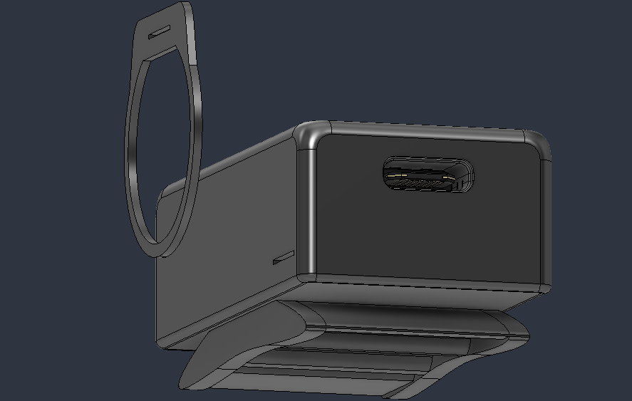
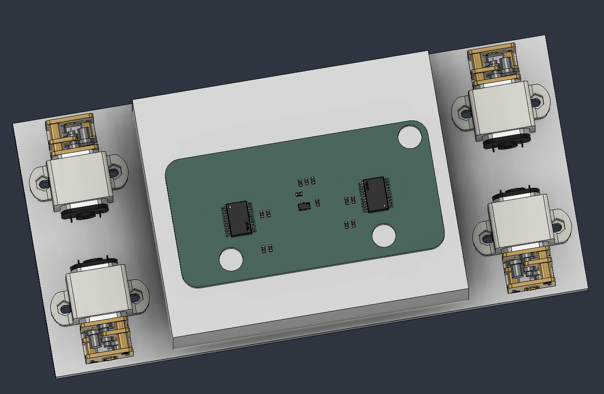
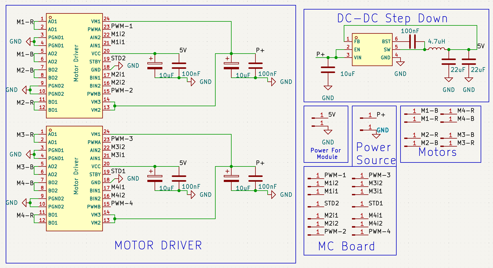
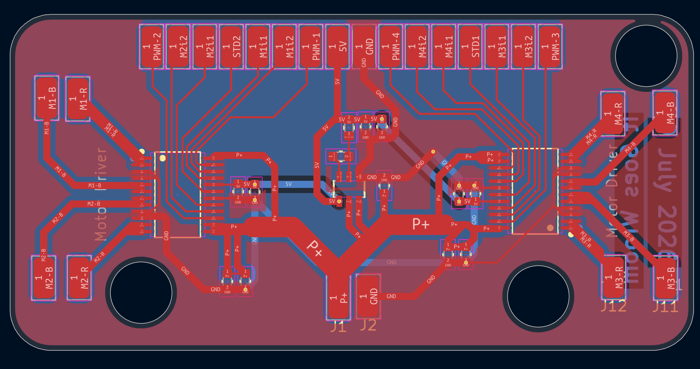

# Rowwy
Rowwy is a hand-movement control car which uses Mecanum wheels.

### CAD Model:
It has two seperate bodies.
1. Controller : 
2. Rowwy : 

### PCB:
Here's my PCB! It was made in KiCad. 

Schematic : 
PCB Footprint : 

### Firmware Overview:
Current version of Firmware is underdevelopment as it has not be implemeted in real life.
This car and controller uses C++ firmware and Arduino IDE for Flashing.

### Assembly Instructions :
1. Flash Firmware in XIAO ESP32 and Wroom Dev-board
2. Solder Motors, Devboard, Battery of car 
3. Solder Gyro-sensor, Flex-Sensor, Battery of controller
4. Check If Everything Works or not, also update the code depending on soldered pins
5. Glue togetther the controller enclosure and bracelet. Also Glue together battery and all circuits on Rowwy's base plate
6. Screw motor holder to base plate and enjoy the ride.

### BOM Table
|Name|Use|Quantity|Distributer|
|-----|---|-------|-----------|
|Battery(0)|Power Source for Car|1|Robu|
|PCB|Main-Circuit|1|JLCPCB|
|XIAO ESP32|Controller|1|Robu|
|Wroom ESP32 Dev Board|Reciever for Car|1|Robu|
|Mecanum Wheels|For Motion|1|Robu|
|N20 geared Motor|Powering Motion|4|Robu|
|Battery(1)|For Controller|1|Robu|
|Flex Sensor|Handbreak Functionality|1|Robu|
|MPU6050|Calculating Handmovement|1|Robu|
|Battery(1)|For Controller|1|Robu|
|SkyRC iMAX B6 Mini|For charging Battery(0)|1|Robu|
|12V 5A DC adapter|To Power SkyRC iMAX|1|Robu|
